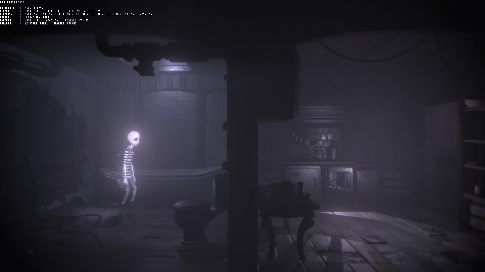
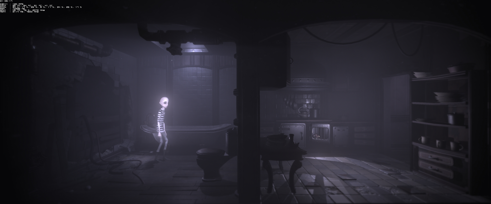

# DARQ Ultrawide Resolution Editor

## What is DARQ?

DARQ is a indie game made by Unfold Games.  
https://store.steampowered.com/app/433550/DARQ/

## Why this GitHub project?

Sadly, DARQ doesn't support ultrawide resolutions, those are not selectable from the settings.

This tool is able to edit the save file and apply whatever resolution you want.

## Does it works well?

Here's the official stance from the developper:  
_'After some more testing we've discovered that widescreen aspect ratio introduces a few gameplay-related issues. We might revisit this after launch and release a patch that allows for 32:9.'_

Please keep in mind that this tool only modifies the resolution of the save file.  
It doesn't attempt to fix any gameplay-related issues, so you might encounter some.

But; As I'm playing through the game, I'll report if I encounter any issues during the different chapters.

- Chapter 1: No issues, works perfectly

## Where can I download it?

Download link:  
https://github.com/Nicnl/darq_ultrawide_resolution_editor/releases/download/0.1/darq_resolution_editor.exe

## How can I use it?

Two ways:

1. Launch it directly, and it'll find the save file on it's own.
2. Drag and drop your DARQ save file directly over the program icon. (just like when you move a file inside a folder)

## Results

### DARQ at default 1920x1080

### DARQ at glorious 3840x1600 master race resolution

